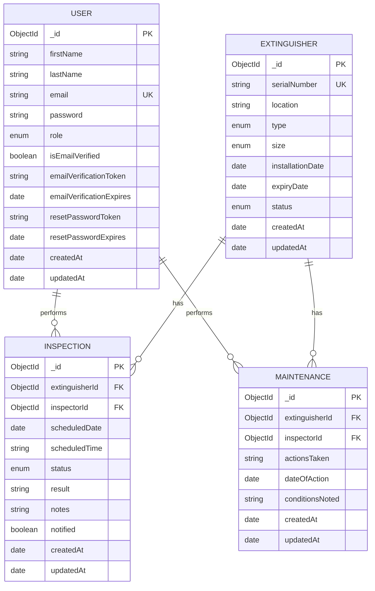
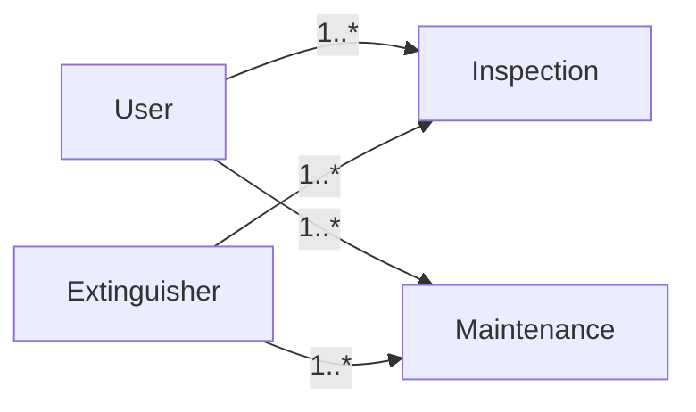

# Fire Extinguisher Management System Database Model

Main entities:

1. User
2. Extinguisher
3. Inspection
4. Maintenance

# Entity Relationship Diagram



# Collection Structure

## Users Collection

| Field                    | Type     | Constraints            |
| ------------------------ | -------- | ---------------------- |
| \_id                     | ObjectId | Primary Key            |
| firstName                | String   | Required               |
| lastName                 | String   | Required               |
| email                    | String   | Required, Unique       |
| password                 | String   | Required               |
| role                     | Enum     | ADMIN, INSPECTOR, USER |
| isEmailVerified          | Boolean  | Default false          |
| emailVerificationToken   | String   | Optional               |
| emailVerificationExpires | Date     | Optional               |
| resetPasswordToken       | String   | Optional               |
| resetPasswordExpires     | Date     | Optional               |
| createdAt                | Date     | Auto Generated         |
| updatedAt                | Date     | Auto Generated         |

## Extinguishers Collection

| Field            | Type     | Constraints                                           |
| ---------------- | -------- | ----------------------------------------------------- |
| \_id             | ObjectId | Primary Key                                           |
| serialNumber     | String   | Required, Unique                                      |
| location         | String   | Required                                              |
| type             | Enum     | WATER, CO2, FOAM, DRY_CHEMICAL                        |
| size             | Enum     | 2.5lbs, 5lbs, 9lbs, 12lbs                             |
| installationDate | Date     | Required                                              |
| expiryDate       | Date     | Required                                              |
| status           | Enum     | ACTIVE, EXPIRED, MAINTENANCE_REQUIRED, OUT_OF_SERVICE |
| createdAt        | Date     | Auto Generated                                        |
| updatedAt        | Date     | Auto Generated                                        |

## Inspections Collection

| Field          | Type     | Constraints                             |
| -------------- | -------- | --------------------------------------- |
| \_id           | ObjectId | Primary Key                             |
| extinguisherId | ObjectId | FK → Extinguisher                       |
| inspectorId    | ObjectId | FK → User                               |
| scheduledDate  | Date     | Required                                |
| scheduledTime  | String   | Required                                |
| status         | Enum     | SCHEDULED, COMPLETED, CANCELLED, FAILED |
| result         | String   | Optional                                |
| notes          | String   | Optional                                |
| notified       | Boolean  | Default false                           |
| createdAt      | Date     | Auto Generated                          |
| updatedAt      | Date     | Auto Generated                          |

## Maintenance Collection

| Field           | Type     | Constraints       |
| --------------- | -------- | ----------------- |
| \_id            | ObjectId | Primary Key       |
| extinguisherId  | ObjectId | FK → Extinguisher |
| inspectorId     | ObjectId | FK → User         |
| actionsTaken    | String   | Required          |
| dateOfAction    | Date     | Required          |
| conditionsNoted | String   | Required          |
| createdAt       | Date     | Auto Generated    |
| updatedAt       | Date     | Auto Generated    |

# Relationship Diagram



# Cardinality

| Relationship               | Cardinality |
| -------------------------- | ----------- |
| User → Inspection          | One-to-Many |
| User → Maintenance         | One-to-Many |
| Extinguisher → Inspection  | One-to-Many |
| Extinguisher → Maintenance | One-to-Many |

# Database Indexes

## User

```text
email (unique)
```

## Extinguisher

```text
serialNumber (unique)
status
expiryDate
```

## Inspection

```text
extinguisherId
inspectorId
scheduledDate
status
```

## Maintenance

```text
extinguisherId
inspectorId
dateOfAction
```
